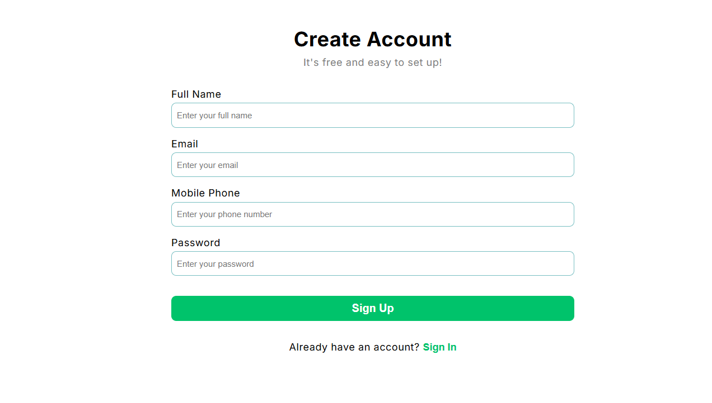

# 📝 Account Creation and Login Form

This is a mini project built with **React.js** that simulates a simple user **registration and login** process with **page navigation** using **React Router**.

## 📌 Features

- ✅ Account creation form with the following fields:
  - Full Name
  - Email
  - Mobile Phone
  - Password
- ✅ Input validation (e.g., required fields, valid email format, numeric phone number)
- ✅ Basic login form using email and password
- ✅ Page navigation between Sign Up and Login
- ✅ Visual feedback for successful submission and validation errors

## 🛠️ Technologies Used

- React.js
- React Router DOM (for page navigation)
- useState (React Hook for managing form state)
- CSS (for styling)

## 📷 Preview

 

## 🚀 Getting Started

To run this project locally:

```bash
# Clone the repository
git clone https://github.com/diasmurillo/React-Projects.git

# Navigate into the project folder
cd React-Projects

# Install dependencies
npm install

# Run the development server
npm run dev
